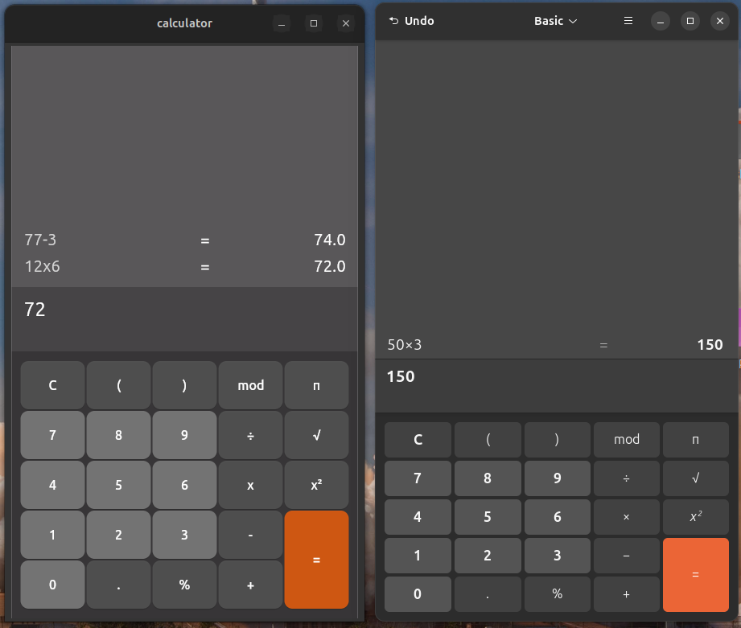

# Flutter Ubuntu Calculator (Basic)

Bu proje, Ubuntu işletim sisteminde yer alan klasik **Calculator (Basic)** uygulamasını Flutter kullanarak yeniden oluşturmayı amaçlamaktadır.

## Özellikler

- Flutter ile masaüstü (desktop) desteği
- Temel matematiksel işlemler (toplama, çıkarma, çarpma, bölme)
- Gerçek zamanlı hesaplama
- Kullanımı kolay ve sade arayüz
- Bilimsel gösterim (e.g. 1.23e+5) desteği

## Ekran Görüntüsü



## Kurulum

```bash
git clone https://github.com/batuhanculhacioglu/flutter_ubuntu_calculator_basic.git
cd flutter_ubuntu_calculator_basic
flutter pub get
flutter run -d linux
